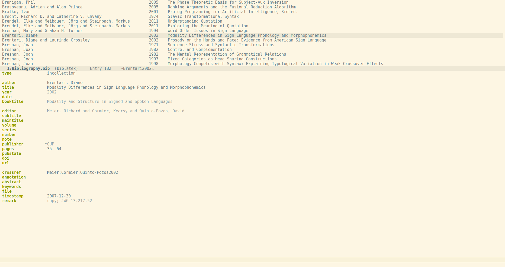
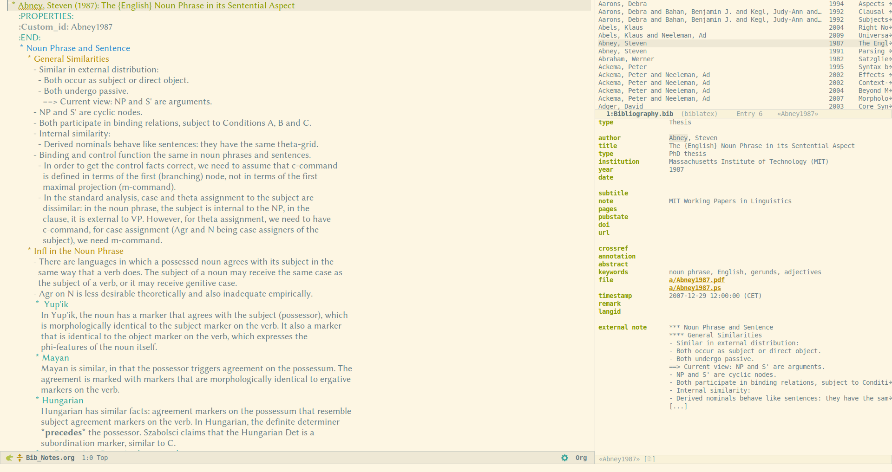
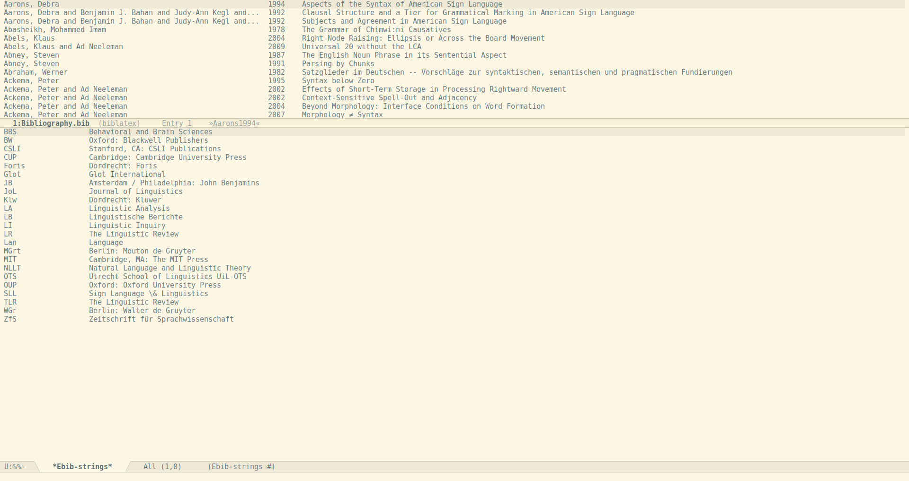

Ebib is a program for managing BibTeX and BibLaTeX databases that runs
inside Emacs. Ebib provides functions with which you can select a key
from the database and have it inserted directly into your LaTeX text.
Similar functionality is available for Markdown and Orgmode.

Ebib provides the standard capabilities that one would expect from a
BibTeX database manager: `.bib` files can be opened, modified (adding,
deleting, modifying entries), searched, and saved. Apart from the
basics, Ebib has quite a few extra features that make managing your
Bib(La)TeX files easier.

## Features

### General

- Visual representation distinguishing obligatory, optional and extra fields.
- Copy/cut/paste mechanism for quickly copying field values. (This fully
  integrates with Emacs’ kill ring.)
- Automatic loading of `.bib` files upon start-up.
- Extensive [user manual](ebib-manual.md).

### BibTeX / BibLaTeX

- Support for both BibTeX and BibLaTeX files.
- Creating and editing `@string` and `@preamble` definitions is supported
  (`@comment`s are kept, but are not editable).
- BibTeX / BibLaTeX entry and field types can be customised, allowing adaptation
  for non-standard and personal bibliography styles.
- Automatic creation of entry keys (using the functionality of Emacs’
  `bibtex-mode`).
- Field values containing newlines are supported, allowing the creation of
  annotated bibliographies.
- Crossreferencing is supported, both BibTeX and BibLaTeX mechanisms.
- The database can be saved with the entries in the `.bib` file sorted on
  user-specified fields (useful in ConTeXt).

### Databases

- Multiple `.bib` files can be opened at the same time.
- Easily create a separate `.bib` file for a paper, article or book through a "slave" database.
- Databases can be merged; specific entries or `@preamble` and `@string` definitions can be exported to other databases or to a `.bib`file.

### Searching

  - Simple regexp searches can be performed on a database, searching the
    contents of all fields of each entry.
  - Complex search queries with logical `and`, `or` and `not` operators,
    built up interactively, can be performed, with the possibility of
    searching only specific fields. Search queries can be saved for
    later reuse.

### LaTeX / Org / Markdown integration

- From within a LaTeX, Org mode or [Pandoc](https://pandoc.org) document, it is
  possible to select a Bib(La)TeX key using standard Emacs completion,
  [Ivy](https://github.com/abo-abo/swiper), or
  [Helm](https://github.com/emacs-helm/helm), and insert a citation into the
  document. This can also be set up for other document formats that support
  automatic bibliographies.
- Inside Ebib, it is possible to push entries to a LaTeX / Org mode / Markdown
  buffer.
- Quick summary of entries into a `*Help*` buffer.
- Creating a `.bib` file from a `.bbl` file, allowing you to create a `.bib`
  file for a LaTeX document containing only the references in the document.

### Miscellaneous

- Entries can be imported from text buffers or from the `*scratch*` buffer
  (allowing copy & paste of BibTeX entries, e.g. from the Internet).
- A URL stored in a BibTeX field can be extracted and sent to a browser.
- Files stored in a BibTeX field can be opened with user-configurable viewers.
- A time stamp can be added to each new entry, allowing you to keep track of new
  additions in the database.
- (Parts of) databases can be printed, either as a list of references typeset by
  BibTeX / BibLaTeX, or directly as database entries.
- Keywords can be stored in a file to aid in maintaining uniformity in keywords
  within and across `.bib` files.

## Screenshots

Visually, Ebib is not very spectacular, but to get an impression of what it
looks like, you can look at the following three screenshots. The first shows
Ebib’s standard lay-out, with the list of entry keys in the top window and the
fields of the currently highlighted entry in the bottom window. The field values
displayed in a lighter gray colour come from the cross-referenced entry. (The
colours Ebib uses are inherited from the current colour theme, but they can be
customised independently.)

In the second image, which uses an alternative partial-frame layout, the string
`"Geraci"` is highlighted as the result of a text search. It also shows a buffer
with a note for the highlighted entry. The third screenshot shows the strings
buffer in the lower window, where you can edit the `@String` definitions in the
database.

## Manual

The complete user manual for Ebib is available in html format
[here](ebib-manual.md). If Ebib is installed from Melpa, the manual is also available inside Emacs in Info format.

## Installation

The easiest way to install Ebib is to use [Melpa](http://melpa.org/).

If you want to download the source, you can clone the [git
repository](https://github.com/joostkremers/ebib.git) for Ebib, or get a
tar ball from the [Github releases
page](https://github.com/joostkremers/ebib/releases). Note that Ebib depends on [parsebib](https://github.com/joostkremers/parsebib), which therefore also needs to be installed.

## Support

If you want to ask a question or report an issue, you can send me an [email](mailto:ebib@joostkremers.fastmail.fm), or, if you happen to have a Github account, open an issue on the [Github
issue tracker](https://github.com/joostkremers/ebib/issues?state=open).
